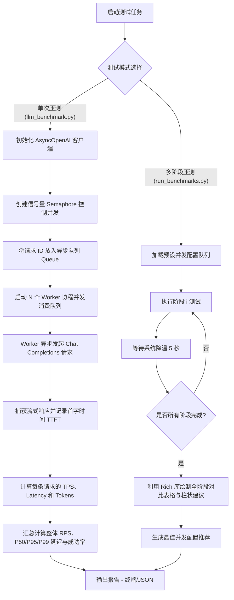

# 📊 LLM-Benchmark 性能与压力测试工具使用说明书

`LLM-Benchmark` 是一款专为大语言模型（LLM）服务设计的**异步高并发压力测试与性能评估工具**。该工具采用 Python 异步协程机制（`asyncio` + `AsyncOpenAI`），能够模拟高并发请求场景，精准测量并评估 LLM 服务的吞吐量、响应延迟、首字延迟（TTFT）及成功率，帮助您压测并找出 LLM 部署服务的性能极限与瓶颈。

---

## 🗺️ 架构与工作流程

为了更好地理解该工具的工作原理，以下是工具的请求调度与多阶段压测工作流程：



---

## ✨ 功能特点

* 🚀 **异步高并发设计**：基于 `asyncio` 和 `openai` 的异步库，能够以极低的本地 CPU/内存开销模拟数百甚至数千的并发连接。
* ⏱️ **流式 TTFT 精准测量**：支持流式（Streaming）响应解析，能够精准捕捉 **首字响应延迟（Time to First Token, TTFT）**，这对于评估交互式聊天体验至关重要。
* 📈 **多维度指标统计**：
  * **吞吐量**：每秒请求数 (RPS)、每秒生成 Token数 (TPS)。
  * **延迟**：平均延迟、P50/P95/P99 延迟分位数。
  * **首字时间**：平均 TTFT、P50/P95/P99 TTFT。
  * **稳定性**：成功率统计。
* 📊 **多阶段自动压测**：支持自动化梯度加压测试（1 ~ 300 并发），并自动分析生成包含性能曲线建议、最佳配置推荐的可视化终端报告。
* 📝 **长短文本多场景**：内置丰富的日常短文本提示词和需要长上下文背景的问答对，真实模拟不同的实际业务场景。
* 🐳 **开箱即用容器化**：提供 Docker 支持，一键拉取或构建，免去本地 Python 环境配置烦恼。
* 🖥️ **可视化操作界面**：全新推出基于 Streamlit 的 Web 可视化看板，支持在页面上动态配置压测参数、一键执行，并生成精美丰富的数据图表。

---

## 🛠️ 环境准备与安装

项目支持**本地运行**和 **Docker 容器运行**两种方式。

### 方式一：本地 Python 环境配置

> [!NOTE]
> 推荐使用 Python 3.10 或更高版本以获得最佳的异步协程性能。

1. 克隆或进入项目根目录：
   ```bash
   cd /Users/joker/develop/code/project/llm-benchmark
   ```

2. 创建并激活虚拟环境（可选但推荐）：
   ```bash
   python3 -m venv .venv
   source .venv/bin/activate
   ```

3. 安装依赖包：
   ```bash
   pip install --upgrade pip
   pip install -r requirements.txt
   ```

---

### 方式二：Docker 容器化运行（免安装）

如果您希望在干净、隔离的环境中快速启动，或者在服务器集群上进行测试，可以使用 Docker：

1. **拉取官方预建镜像**（推荐）：
   ```bash
   # 从 Docker Hub 拉取镜像
   docker pull samge/llm-benchmark
   
   # 重新标记为本地镜像名以简化命令
   docker tag samge/llm-benchmark llm-benchmark
   ```

2. **或者本地手动构建镜像**：
   ```bash
   docker build -t llm-benchmark .
   ```

3. **创建输出挂载目录**（用于持久化保存 JSON 格式的详细测试报告）：
   ```bash
   mkdir -p ./output
   ```

### 方式三：使用 Docker Compose 启动 Web UI（最便捷）

项目提供了 `docker-compose.yaml` 文件，可以一键构建并运行 Streamlit 可视化 Web UI，无需手动管理端口或文件挂载。

1. **一键启动服务**：
   ```bash
   docker compose up -d --build
   ```

2. **访问可视化面板**：
   启动成功后，在浏览器访问 `http://localhost:8501` 即可打开 LLM 性能测试可视化界面。

3. **停止服务**：
   ```bash
   docker compose down
   ```

---

## 📋 参数详解

项目由两个核心脚本组成：`llm_benchmark.py`（单次细粒度压测）和 `run_benchmarks.py`（多阶段梯度压测）。

### 1. `llm_benchmark.py` 参数说明（单次压力测试）

用于对特定并发数和请求量进行定向深度测试。

| 参数名 | 类型 | 是否必填 | 默认值 | 参数说明 |
| :--- | :--- | :---: | :--- | :--- |
| `--llm_url` | `str` | **是** | - | 大模型服务端的 API 基准地址（例如 `http://127.0.0.1:8000/v1`） |
| `--api_key` | `str` | 否 | `default` | 访问 API 所需的 API Key，无认证时可保持默认或输入任意字符 |
| `--model` | `str` | 否 | `deepseek-r1` | 调用的模型名称（需与服务端注册的 model list 一致） |
| `--num_requests` | `int` | **是** | - | 本次测试发送的**总请求数量** |
| `--concurrency` | `int` | **是** | - | **最大并发请求数**（控制同时处于 active 状态的协程数） |
| `--output_tokens` | `int` | 否 | `50` | 限制每条请求模型生成的最大 Token 数量（`max_tokens`） |
| `--request_timeout` | `int` | 否 | `60` | 单个请求的超时时间（秒）。超时未完成的请求将计为失败 |
| `--use_long_context` | `flag` | 否 | 无 | 开启此开关后，测试将随机使用包含约 500-1000 字上下文的长提示词（默认使用短提示词） |
| `--output_format` | `str` | 否 | `line` | 输出格式，可选：`json`（纯 JSON 结构数据）、`line`（易读文本）、`both`（两者都输出） |

---

### 2. `run_benchmarks.py` 参数说明（多阶段自动梯度压测）

该脚本将自动执行一系列预设的并发梯度测试（并发数分别设为：**1、50、100、200、300**），并在每次测试间休息 5 秒以让服务端“冷温”。最后分析数据并输出图形化报表。

| 参数名 | 类型 | 是否必填 | 默认值 | 参数说明 |
| :--- | :--- | :---: | :--- | :--- |
| `--llm_url` | `str` | **是** | - | 大模型服务端的 API 基准地址（例如 `http://127.0.0.1:8000/v1`） |
| `--api_key` | `str` | 否 | `default` | 访问 API 所需的 API Key |
| `--model` | `str` | 否 | `deepseek-r1` | 调用的模型名称 |
| `--use_long_context` | `flag` | 否 | 无 | 是否启用长文本测试场景（从内置的大文本库中抽取内容） |

> [!TIP]
> 多阶段压测运行结束后，会自动在项目根目录下的 `output/` 文件夹中生成一个以时间戳命名的详细测试数据 JSON 文件（如 `output/benchmark_results_20260519_114820.json`），方便后续存档及对比。

---

## 🚀 实战使用示例

### 场景一：测试本地部署的 Ollama 服务

本地运行的 Ollama 默认端口为 `11434`，兼容 OpenAI 的接口路径为 `/v1`。

#### A. 单次快速测试：
测试 `qwen2.5` 模型在并发为 5 的情况下，完成 20 个请求的性能表现，限制生成 100 个 Token。
```bash
python llm_benchmark.py \
  --llm_url "http://localhost:11434/v1" \
  --model "qwen2.5" \
  --num_requests 20 \
  --concurrency 5 \
  --output_tokens 100
```

#### B. 全套梯度压测：
自动测试在并发 1~300 下的系统吞吐与响应能力：
```bash
python run_benchmarks.py \
  --llm_url "http://localhost:11434/v1" \
  --model "qwen2.5"
```

---

### 场景二：测试企业级 vLLM 部署的高性能推理集群

vLLM 具有强大的高并发与 PageAttention 吞吐优化，适合进行高强度加压测试。

#### A. 长文本场景的百级并发性能摸底：
总共发送 500 个请求，保持 100 并发，请求中使用长文本上下文，限制输出 150 tokens，设置超时时间为 120 秒：
```bash
python llm_benchmark.py \
  --llm_url "http://vllm-server-ip:8000/v1" \
  --api_key "your-secure-api-key" \
  --model "deepseek-ai/DeepSeek-R1-Distill-Qwen-32B" \
  --num_requests 500 \
  --concurrency 100 \
  --output_tokens 150 \
  --request_timeout 120 \
  --use_long_context \
  --output_format both
```

#### B. 多阶段自动化测试（带降温冷却）：
```bash
python run_benchmarks.py \
  --llm_url "http://vllm-server-ip:8000/v1" \
  --api_key "your-secure-api-key" \
  --model "deepseek-ai/DeepSeek-R1-Distill-Qwen-32B" \
  --use_long_context
```

---

### 场景三：使用 Docker 进行测试

使用 Docker 容器，可以将测试结果直接挂载并输出到本机的 `./output` 目录下。

#### A. Docker 运行单次并发测试：
```bash
docker run -it --rm \
  -v $PWD/output:/app/output \
  llm-benchmark \
  python llm_benchmark.py \
  --llm_url "http://host.docker.internal:11434/v1" \
  --model "qwen2.5" \
  --num_requests 50 \
  --concurrency 10
```
> [!IMPORTANT]
> 如果大模型服务部署在本机（localhost），在 Docker 容器内部访问本机服务时，需将地址替换为 `http://host.docker.internal:端口`（macOS/Windows 环境下有效）。

#### B. Docker 运行多阶段完整评估：
```bash
docker run -it --rm \
  -v $PWD/output:/app/output \
  llm-benchmark \
  python run_benchmarks.py \
  --llm_url "http://192.168.1.100:8000/v1" \
  --model "deepseek-r1" \
  --use_long_context
```

---

## 🖥️ 可视化操作界面 (Web UI)

本项目全新推出基于 Streamlit 框架的 Web 界面，让压测配置与结果展示更加直观、优雅。

### 启动 Web 界面
确保您已安装所有依赖（包含 `streamlit`、`plotly` 等）。在项目根目录运行以下命令即可启动可视化面板：

```bash
streamlit run webui.py
```

启动后，浏览器将自动打开地址（通常为 `http://localhost:8501`）。

### 界面功能亮点
* **左侧侧边栏配置**：便捷设置大模型服务端 URL、API Key、模型名称以及所有核心压测参数（总请求数、并发数、超时时间等）。
* **一键压测与进度反馈**：点击“Run Benchmark”后，页面将展示加载进度和压测状态，测试完毕立即呈现结果。
* **丰富的数据大屏展示**：
  * **核心指标一览**：快速查看总请求、成功率、TPS 及总用时等数据卡片。
  * **详细分位数表格**：以带颜色梯度的数据表展示延迟（Latency）、首字时间（TTFT）及 Token 速度的 Average、P50、P95、P99 数据。
  * **动态图表**：结合 Plotly 渲染的延迟与 TPS 柱状分布图。
  * **JSON 数据洞察**：底部支持一键展开查看原生的详细 JSON 测试结果数据。

---

## 📊 测试报告与数据深度解析

### 1. 终端可视化报告示例解析

使用 `run_benchmarks.py` 运行测试后，终端会打印如下结构化信息：

```
╔══════════════════════════════════════════════════════════╗
║                       性能测试汇总报告                   ║
╚══════════════════════════════════════════════════════════╝

基本信息:
╒══════════════════════╤════════════════════════════════════════════════╕
│ 名称                 │ 值                                             │
╞══════════════════════╪════════════════════════════════════════════════╡
│ 模型                 │ deepseek-r1                                    │
├══════════════════════┼════════════════════════════════════════════════┤
│ 长文本模式           │ 否                                             │
├══════════════════════┼════════════════════════════════════════════════┤
│ 总生成Token数        │ 131,000                                        │
├══════════════════════┼════════════════════════════════════════════════┤
│ 总测试时间           │ 245.34 秒                                      │
├══════════════════════┼════════════════════════════════════════════════┤
│ 平均Token生成速率    │ 533.95 tokens/sec                              │
╘══════════════════════╧════════════════════════════════════════════════╛

详细性能指标:
┌────────┬────────┬──────────────┬──────────────┬──────────┬──────────────┬────────┐
│ 并发数 │    RPS │ 平均延迟(秒) │  P99延迟(秒) │  平均TPS │   首Token延迟│ 成功率 │
├────────┼────────┼──────────────┼──────────────┼──────────┼──────────────┼────────┤
│      1 │   4.12 │        0.243 │        0.312 │    82.40 │        0.052 │ 100.0% │
│     50 │  68.54 │        0.729 │        1.240 │  1370.80 │        0.180 │ 100.0% │
│    100 │ 112.30 │        0.890 │        1.890 │  2246.00 │        0.245 │ 100.0% │
│    200 │ 145.20 │        1.377 │        3.102 │  2904.00 │        0.410 │  98.5% │
│    300 │ 121.40 │        2.471 │        6.820 │  2428.00 │        0.980 │  84.2% │
└────────┴────────┴──────────────┴──────────────┴──────────┴──────────────┴────────┘

性能最佳配置:
 最高 RPS: 并发数 200 (145.20 req/sec)
 最低延迟: 并发数 1 (0.243 秒)

性能建议:
• 最佳并发数范围在 200 附近
• 在高并发时成功率偏低（当前 300 并发成功率为 84.2%），建议检查系统显存或限制大模型服务端的最大并发排队数
```

### 2. 核心指标说明

* **RPS (Requests Per Second)**：大模型服务端每秒能够成功处理完并返回的请求个数。数值越高，系统的**吞吐量越大**。
* **TPS (Tokens Per Second)**：每秒生成的总 Token 数量。该指标受并发度与模型生成速度（Speed）的共同影响。
* **首字延迟 (TTFT / Time to First Token)**：从客户端发送请求到收到大模型返回的**第一个 Token** 的时间间隔。这反映了模型的启动/推理响应速度。在交互式聊天中，**TTFT 控制在 0.2s - 0.5s 内体验较佳**，大于 1.5s 会感觉明显卡顿。
* **P99 延迟**：99% 的请求都在此延迟时间（秒）内完成。用于衡量极端负荷下系统的尾部延迟波动，数值越稳定越好。

---

## 🛠️ 高级调优与自定义

### 1. 修改/增加测试数据集（提示词）

如果您想用自己业务领域的提示词进行评估，可以修改 `llm_benchmark.py` 中的提示词库：

* **修改短文本提示词**：定位到第 13 行的 `SHORT_PROMPTS` 列表，直接增加或修改您自己的 Prompt。
* **修改长文本提示词**：定位到第 32 行的 `LONG_PROMPT_PAIRS` 结构体，其采用如下格式：
  ```python
  {
      "prompt": "您的核心问题？",
      "context": "这里填充大量的参考背景知识、文本、或者参考文档内容..."
  }
  ```

### 2. 自定义梯度并发级别

在 `run_benchmarks.py` 的第 15 行 `run_all_benchmarks` 函数中，预设了 5 个测试梯队。您可以自由增删或调整压测档位，以适配更轻量或更强劲的服务器：

```python
configurations = [
    {"num_requests": 10, "concurrency": 1, "output_tokens": 100},      # 起跑线测试
    {"num_requests": 50, "concurrency": 10, "output_tokens": 120},     # 低负载
    {"num_requests": 100, "concurrency": 50, "output_tokens": 120},    # 中负载
    {"num_requests": 300, "concurrency": 150, "output_tokens": 150},   # 高负载
    {"num_requests": 500, "concurrency": 250, "output_tokens": 150},   # 极限压测
]
```

---

## ⚠️ 常见瓶颈与诊断指南

大模型压测过程中出现失败或延迟激增，通常由以下几种情况导致，可以根据测试报告进行针对性优化：

1. **TTFT 延迟过高（> 2秒），但成功率 100%**：
   * *诊断*：这通常是因为推理服务器（如 vLLM 或 Ollama）启用了排队机制，并发超出了 GPU 实时计算能力，导致请求在服务端排队等待调度。
   * *优化建议*：增加显卡、使用 KV Cache 量化、或者调大服务端的 `max_num_seqs`（最大并发序列数）。

2. **高并发下成功率骤降，日志抛出 Timeout/500/503 错误**：
   * *诊断*：服务端过载崩溃，或者显存溢出（OOM）。
   * *优化建议*：降低测试并发数；降低服务端的最大并发排队限制；在启动服务端（如 vLLM）时调整 `--gpu-memory-utilization` 分配更多显存，或降低最大上下文长度限制。

3. **并发数增大，但 RPS 和 TPS 几乎没有提升**：
   * *诊断*：系统已经达到硬件计算瓶颈，或者服务端未开启并发处理（单线程推理）。
   * *优化建议*：确保推理引擎开启了 Continuous Batching（如 vLLM、TGI、Ollama 等默认已支持），并检查 GPU 利用率是否已经达到 100%。

---

## 📄 开源协议

本项目使用 [MIT License](LICENSE) 许可协议。欢迎提交 PR 和 Issue！
